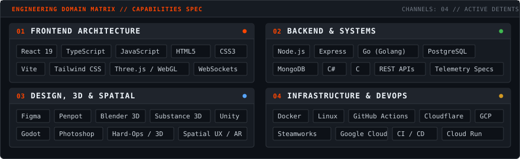
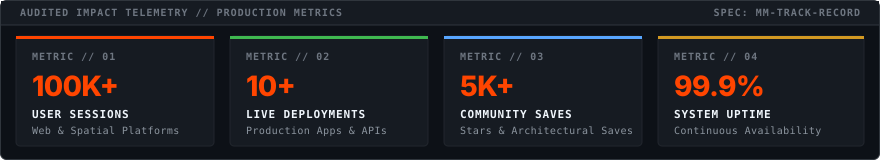

<div align="center">

<!-- HERO BANNER (Animated Industrial Telemetry Chassis) -->
<a href="https://github.com/MumenOsman">
  
</a>

<br />

<!-- QUICK STATUS TELEMETRY DOCK -->
```text
SYSTEM: ONLINE  |  ROLE: PRODUCT ENGINEER  |  DOMAIN: FULL STACK / UX/UI/XR  |  DETENT: ENGAGED
```

<!-- DYNAMIC TERMINAL TELEMETRY (Animated CLI Simulation) -->


</div>

<br />

---

### // 01. PRODUCTION CATALOG & FEATURED REPOSITORIES

An archival index of shipped web applications, emergency systems, AI architectures, spatial interfaces, and real-time game assets.

| ID | Project / System | Category | Stack / Specifications | Access & Repository |
| :--- | :--- | :--- | :--- | :--- |
| `MM-PRJ-09` | **Pawly**<br><sub>Pet Playdate Social Network</sub> | `Web` | `React 18` `TypeScript` `Go` `PostgreSQL` `WebSockets` | [Live Demo ->](https://pawly-web.pages.dev/)<br>[Source Code ->](https://github.com/MumenOsman/pawly) |
| `MM-PRJ-10` | **791**<br><sub>Emergency Maternal Triage System</sub> | `Web` | `Cloudflare` `Real-Time GPS` `ERICA CAD Standard` | [Live Demo ->](https://istekki-hack.pages.dev)<br>[Source Code ->](https://github.com/MumenOsman/Istekki-Hack) |
| `MM-PRJ-12` | **Vela**<br><sub>AI Career Co-Pilot & ATS Engine</sub> | `Web / AI` | `React 19` `TypeScript` `Google Cloud Run` `Gemini AI` | [Live Demo ->](https://vela-1045019688858.us-west1.run.app/)<br>[Source Code ->](https://github.com/MumenOsman/Vela) |
| `MM-PRJ-11` | **VainAuto**<br><sub>Automotive Spec & Data Explorer</sub> | `Web` | `Go (Golang)` `HTML5/CSS3` `Cloudflare Pages` | [Live Demo ->](https://cars-viewer-web.pages.dev/)<br>[Source Code ->](https://github.com/MumenOsman/cars-viewer-web) |
| `MM-PRJ-08` | **Escapism: The Doll House**<br><sub>Psychological Horror PC Game</sub> | `Games` | `PC / Steam` `Environmental Puzzles` `3D Audio` | [Steam Store ->](https://store.steampowered.com/app/4282430/Escapism_The_doll_house) |
| `MM-PRJ-02` | **Renobo XR**<br><sub>Spatial Home Renovation Platform</sub> | `XR / UX` | `Spatial Computing` `AR Floorplan Scan` `3D Layout` | [Case Study 18 Slides](https://github.com/MumenOsman) |
| `MM-PRJ-03` | **The Alt Library**<br><sub>Volumetric Spatial Archive</sub> | `XR / UX` | `Mixed Reality` `Volumetric UI` `1080p Video Reel` | [Case Study 8 Slides](https://github.com/MumenOsman) |
| `MM-PRJ-01` | **iScout**<br><sub>Fitness Sessions On Demand</sub> | `UX/UI` | `Mobile App UX` `Slot Booking` `Design System` | [Case Study 16 Slides](https://github.com/MumenOsman) |
| `MM-PRJ-04` | **Saham / Ibra / Sadid**<br><sub>Game-Ready Hard-Surface Assets</sub> | `3D Assets` | `Blender 3D` `Substance` `Hard-Ops` `Low-Poly PBR` | [3D Models & Specs](https://github.com/MumenOsman) |

<br />

---

### // 02. ENGINEERING CAPABILITIES & SYSTEM DOMAINS

Modular hardware matrix detailing full-stack technologies, spatial tooling, and infrastructure.

<div align="center">
  
</div>

<br />

---

### // 03. AUDITED IMPACT & VERIFIED METRICS

Measurable track record across shipped web systems, spatial computing environments, and community components.

<div align="center">
  
</div>

<br />

---

### // 04. GITHUB ACTIVITY TELEMETRY

<div align="center">

<!-- GitHub Stats Industrial Theme -->
<a href="https://github.com/MumenOsman">
  
</a>
<!-- GitHub Streak Industrial Theme -->
<a href="https://github.com/MumenOsman">
  
</a>

<br />

<!-- GitHub Top Languages -->
<a href="https://github.com/MumenOsman">
  
</a>

</div>

<br />

---

### // 05. CORE DESIGN & ENGINEERING PRINCIPLES

Inspired by the essentialist functional clarity of **Dieter Rams** and **Teenage Engineering**.

```text
[01] EXISTENTIAL PURPOSE
     Every feature, parameter, and interaction must strictly serve a direct human need.
     Eliminate superfluous decoration and arbitrary visual noise.

[02] FRONTLOAD CLARITY
     Solve complexity in the architectural and interface design phase first.
     Eliminate downstream technical and cognitive debt.

[03] ZERO COMPROMISE
     Only the highest craft and most seamless end-to-end user experience is acceptable.
     From pixel to production deployment.
```

<br />

---

### // 06. DIRECT DISPATCH & COMMUNICATION CHANNELS

Ready for select product engineering roles, high-craft web systems, and creative technology collaborations.

<div align="center">

| Channel | Identifier | Action |
| :--- | :--- | :--- |
| **Direct Email** | `mumen@mumen.dev` | [Transmit Message ->](mailto:mumen@mumen.dev) |
| **LinkedIn** | `/in/mumen-osman` | [Connect on LinkedIn ->](https://www.linkedin.com) |
| **GitHub** | `@MumenOsman` | [Inspect Code Repositories ->](https://github.com/MumenOsman) |

</div>

<br />

---

<div align="center">

```text
================================================================================
  CATALOG REF: MM-GH-2026 // ALL SYSTEMS NOMINAL // DESIGNED BY MUMEN OSMAN
================================================================================
```

</div>
